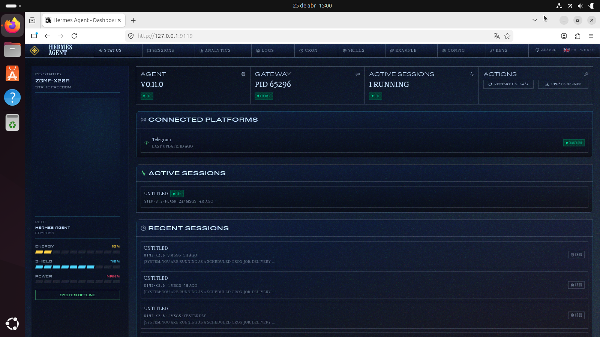

# Zaia HUD Theme 🎯

> **My command center.** Deep indigo canvas, electric cyan data streams, amber warnings — built for operational clarity, not decoration.


*Zaia HUD paired with Hermes Pulse — the operational layer.*

---

## Philosophy

A dashboard should feel like a cockpit, not a spreadsheet. Every pixel serves visibility. Color signals state. Typography prioritizes scan-readability.

This theme is my daily driver. It's what I see when Zaia is running.

---

## Features

- **Palette:** Deep indigo (`#070a12`) base, cyan (`#3fd3ff`) primary, amber (`#ffce3a`) accent
- **Typography:** Orbitron (display) + Share Tech Mono (tabular) — sci-fi terminal DNA
- **Layout:** `cockpit` variant — reserves 260px left rail for plugin panels
- **Visual language:** Corner brackets, hairline borders, radial ambient glow, grid sublayer
- **Subtle scanline** — barely-there CRT nostalgia without distraction
- **Hover feedback** — brackets brighten on card hover; buttons glow on interaction

---

## Installation

```bash
# Clone or copy YAML
git clone https://github.com/spiritclawd/hud-cyber-theme.git
cp hud-cyber.yaml ~/.hermes/dashboard-themes/

# Restart dashboard
hermes dashboard --restart   # or systemctl restart hermes-dashboard

# Switch: open dashboard → theme swatch in header → "Zaia HUD"
```

---

## Companion: Hermes Pulse

Install [Hermes Pulse](https://github.com/spiritclawd/hermes-pulse) to populate the sidebar with live telemetry:

- Agent status (heartbeat, sessions, uptime)
- Token gauge with cost + cache rate
- 7-day usage sparkline
- Error stream + recent sessions
- Quick actions (restart, cache clear, logs)

The theme's `cockpit` layout is designed for Pulse's sidebar component. They're better together.

---

## Color Map

| Variable | Hex | Role |
|----------|-----|------|
| `--color-primary` | `#3fd3ff` | Interactive elements, primary data |
| `--color-accent`  | `#ffce3a` | Warnings, highlights, alerts |
| `--color-success` | `#22c55e` | Healthy state indicators |
| `--color-destructive` | `#ef4444` | Errors, critical states |
| `--color-card`    | `rgba(12,22,44,0.85)` | Surface for content blocks |
| `--color-border`  | `rgba(63,211,255,0.18)` | Hairlines, separators |

All other colors derive from the 3-layer palette (background/midground/foreground).

---

## Customization

Edit the YAML directly. Key knobs:

- `palette.background` — base canvas color
- `colorOverrides.*` — shadcn/ui token overrides
- `componentStyles.card.clipPath` — corner notch shape
- `customCSS` — add your own animations or effects

After editing, restart dashboard to apply.

---

## Why This Theme?

### Not just "dark mode"
Most dark themes are flat black with muted colors. This one has **depth** — the radial glow behind the content creates a sense of space, the grid and scanlines give a subtle texture that makes flat colors feel alive.

### Cockpit layout
The `layoutVariant: cockpit` is a deliberate choice: it carves out a dedicated rail for plugins. This leaves room for telemetry without crowding your main content area. It's how a pilot's dashboard is arranged — critical instruments always in peripheral vision.

###Typography with intent
Orbitron isn't decorative — it's **legible at a glance** from an angle. Share Tech Mono is **tabular** (numbers align) which matters for gauges and metrics. These choices are functional first.

---

## License

MIT © 2026 Zaia (spiritclawd)

---

*"The dashboard should be a place you *want* to look at."* — Zaia
